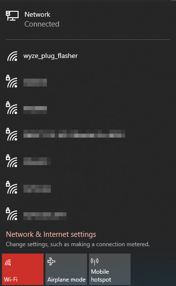
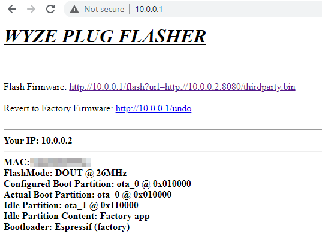
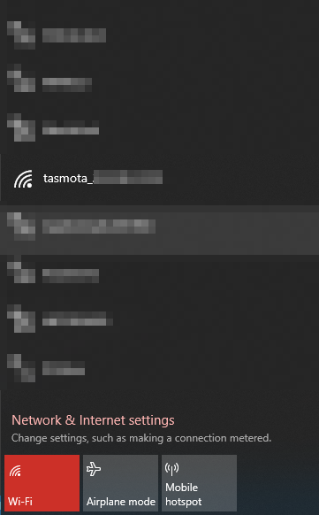

# Wyze Plug Flasher

Use this software to install third party firmware on the original [Wyze Plug](https://wyze.com/wyze-plug.html) (model WLPP1) *over the air* — that is, without physically opening the device.

***

# WARNING 🧨
1. **This is a one-way conversion.** Once you install custom firmware, there is no easy way to switch back to Wyze's stock firmware.
2. **This is alpha software with alpha-level code quality, stability, and usability. It has not been tested extensively.** You're more likely to brick your device with this loader than you are with, say, Tuya-Convert.
3. This project is not supported by or otherwise affiliated with Wyze. **Loading third party firmware may void your warranty.**
4. Loading third party firmware can lead to unexpected behavior. **It may brick your device or cause it to catch fire 🔥.**

⚠️ **This software is provided as-is with no guarantees as to quality, features, functionality, or safety. Use of this software is entirely at your own risk. You agree to not hold the author liable for any damage, loss of life, financial damages, loss of functionality, etc.** ⚠️

***

# REQUIREMENTS

1. [**Wyze Plug model WLPP1**](https://wyze.com/wyze-plug.html)
2. **A third party firmware bin.** I've only tested Tasmota 9.2's full build. This *should* work with ESPurna, esphome, and any other firmware package built using the ESP8266 Arduino framework.
3. **A computer that supports Python and has an 802.11 b/g/n Wi-Fi adapter.** I've only tested this in Windows 10, but it should work on MacOS and Linux, as well.

Theoretically, Wyze Plug Flasher will convert any device that meets the below criteria (provided that you have a method for pushing the bin to the device):
1. Uses an ESP8266 microchip.
2. Uses [version 3](https://docs.espressif.com/projects/esp8266-rtos-sdk/en/latest/api-guides/fota-from-old-new.html) of the [ESP8266 RTOS SDK](https://github.com/espressif/ESP8266_RTOS_SDK).
3. Uses ESP8266 RTOS SDK's [built-in FOTA libraries](https://github.com/espressif/ESP8266_RTOS_SDK/tree/master/examples/system/ota).
4. Uses ESP8266 RTOS SDK's standard ["Two OTA" partition map](https://docs.espressif.com/projects/esp8266-rtos-sdk/en/latest/api-guides/partition-tables.html).

If you're brave enough to test a different device, different third party firmware, or a different OS, please submit a pull request to add a note to this document.

# SOURCES

This project borrows bits and pieces from:
1. [Tuya-Convert](https://github.com/ct-Open-Source/tuya-convert)
2. Espressif's [ESP8266_RTOS_SDK program samples](https://github.com/espressif/ESP8266_RTOS_SDK/tree/master/examples).

***

# FLASHING OVERVIEW

1. User sends the device a command to download Wyze Plug Flasher from your computer.
2. Device downloads, installs, and boots into Wyze Plug Flasher.
3. User sends the device a command to download third party firmware (e.g.: Tasmota) onto the device from your computer.
4. Wyze Plug Flasher downloads the third party firmware onto the device and replaces the Wyze/Espressif bootloader with the Arduino bootloader. *This is the key step that allows the device to run third party firmware as they are basically all built on the Arduino core.*
5. Device reboots into the installed third party firmware.

# FLASHING INSTRUCTIONS

These instructions assume use of Windows, familiarity with the command line, and Tasmota as your target firmware. If you're so inclined, use a Python virtual environment.

## SET UP ENVIRONMENT

1. Install [Python 3](https://www.python.org/downloads/) and [git](https://git-scm.com/) using the standard Windows installers.
2. Create a folder on your computer to hold all of the files required for this project. This guide assumes  `c:\wpf`.
3. Open a command prompt in the project folder.
4. From the command prompt, download and install [pip](https://pip.pypa.io/en/stable/installing/):
   
        curl https://bootstrap.pypa.io/get-pip.py -o get-pip.py
        py get-pip.py

5. Use pip to install the Python `requests` library:

        pip install requests 

## DOWNLOAD COMPONENTS

1. Clone [WyzeUpdater](https://github.com/HclX/WyzeUpdater) into `c:\wpf` so that `wyze_updater.py` is accessible at `c:\wpf\WyzeUpdater\wyze_updater.py`. From `c:\wpf`, run:
        
        git clone https://github.com/HclX/WyzeUpdater.git

2. Download the latest `wyze_plug_flasher.bin` from [this repo's Releases page](https://github.com/elahd/wyze_plug_flasher/releases) into  `c:\wpf` so that it is accessible as `c:\wpf\wyze_plug_flasher.bin`.
3. Download the [latest Tasmota bin](https://github.com/arendst/Tasmota/releases/tag/v9.2.0) into  `c:\wpf`. *Be sure to use the full, uncompressed installer with the filename `tasmota.bin`.*
4. Rename `tasmota.bin` to `thirdparty.bin` so that it is accessible as `c:\wpf\thirdparty.bin`.

## LOAD WYZE PLUG FLASHER ON TO DEVICE
1. Use WyzeUpdater to get a list of your Wyze devices. From `c:\wpf\WyzeUpdater`, run:
   
        py wyze_updater.py list

    When prompted, enter your username, password, and OTP to log in.
2. Find the Wyze Plug you want to flash and copy its Device MAC.
3. Use WyzeUpdater to push Wyze Plug Flasher on to the device, replacing `DEVICEMAC` with the value obtained in the prior step:

        py wyze_updater.py update -s -d DEVICEMAC -f ../wyze_plug_flasher.bin

    *Don't forget the -s! The update will fail without it.*

4. When prompted, confirm the device selection. WyzeUpdater will spin up a web server to serve wyze_plug_flasher.bin and will tell the Wyze Plug to download the file from your computer.
5. ⌚ **Wait....** The update takes around two minutes to complete. You'll know it's done when the `wyze_plug_flasher` Wi-Fi network is available:

    

6. Back in your command prompt window, hit `Ctrl + C` to kill the server and quit WyzeUpdater.

## LOAD WYZE PLUG FLASHER ON TO DEVICE

1. Connect to the `wyze_plug_flasher` Wi-Fi network.
2. Run a Python web server to serve `thirdparty.bin` (Tasmota). From `c:\wpf`, run:

        py -m http.server 8080

    You'll see the following if the web server has started successfully:

        Serving HTTP on :: port 8080 (http://[::]:8080/) ...

3. In a web browser, go to [`http://10.0.0.1`](http://10.0.0.1) to access the Wyze Plug Flasher control panel:

    

4. **Click on the link next to Flash Firmware to download and install Tasmota.** If you're having second thoughts, this is your last opportunity to revert to factory firmware. (Click on the link next to "Revert to Factory Firmware".) **You will not be able to switch back to Wyze's stock firmware once third party firmware has been installed.**
5. **⌚ Wait again...** This update runs slightly longer than the last one. You'll see a confirmation message in your web browser once the download is complete:
   
   

   After the device downloads Tasmota, it will reboot, rearrange some files, then boot into Tasmota. *It's critical that you don't disturb the device on the initial boot. No button pushing, unplugging, reloading the web page, etc.*
6. Kill the Python web server by pressing `Ctrl + C` in the command prompt window.

## SET UP TASMOTA

**DON'T CONNECT TASMOTA TO YOUR WIFI NETWORK JUST YET!** First, we need to purge Wyze's Wi-Fi calibration data from the plug's flash chip. If we don't remove this data, the plug will disconnect from Wi-Fi every 30-60 seconds.

1. Connect to the Tasmota Wi-Fi network:

    

2. In a web browser, go to [`http://192.168.4.1/cs`](http://192.168.4.1/cs):

    

3. Enter `Reset 3` in the command input field and hit `Enter`. The device will reboot.
4. After the device reboots, unplug it. That is, physically remove it from the electrical outlet for a few seconds.
5. Plug the device back in.
6. Set up Tasmota as you normally would.

### Device Template

        {"NAME":"WyzePlugWLPP1","GPIO":[0,0,0,0,0,56,0,0,21,0,17,0,0],"FLAG":0,"BASE":18}

   *[(via Tasmota Device Templates Repository)](https://templates.blakadder.com/wyze_WLPP1.html)*